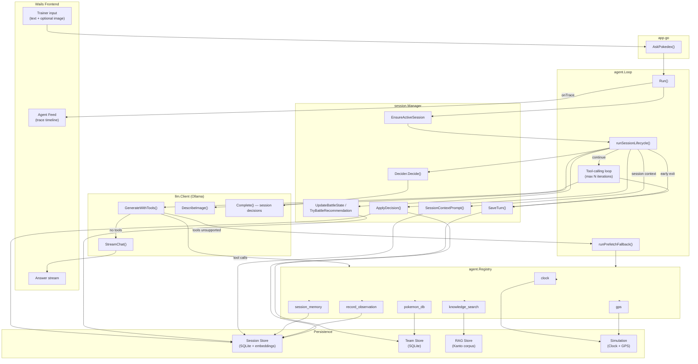
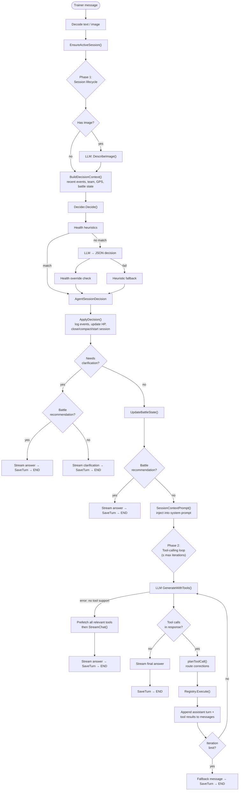
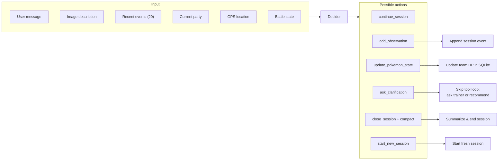
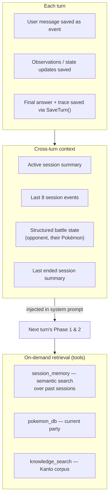

# Multi-Turn Agent Architecture

This document describes how the Agentic RAG Pokédex processes each trainer message: session lifecycle, tool-calling loop, memory model, and UI trace events.

Entry point: `AskPokedex()` in `app.go` → `agent.Loop.Run()`.

## High-Level Architecture

## Single-Turn Flow

Each trainer message passes through up to three phases. Several paths short-circuit before the main tool loop.

## Session Decision Block

Before the agent answers, a separate LLM call (with heuristic fallbacks) decides how to manage session state.

### Decision actions

| Action | Effect |
|--------|--------|
| `continue_session` | Keep the active session; no structural change |
| `add_observation` | Record a gameplay event (battle, location, note) |
| `update_pokemon_state` | Update party HP in the team store |
| `ask_clarification` | Return early with a clarification prompt |
| `close_session` / `compact_session` | Summarize and end the current session |
| `start_new_session` | Begin a fresh session (often after a location shift) |

Decision order in `Decider.Decide()`:

1. Health-update heuristics (regex on fainted/injured language)
2. LLM JSON decision via `Complete()`
3. Health override check (heuristics win over LLM for HP updates)
4. Heuristic fallback if the LLM call fails

## Tool-Calling Loop

The core ReAct-style loop runs until the model returns a final answer or hits the iteration cap (`AGENT_MAX_ITERATIONS`, default 5).

| Step | What happens |
|------|----------------|
| **System prompt** | Kanto Pokédex persona + active session context + battle/health hints |
| **Human message** | Trainer text ± image binary part |
| **LLM turn** | `GenerateWithTools()` returns thought text + optional tool calls |
| **Route correction** | e.g. `session_memory` → `pokemon_db` when the question is about the current team |
| **Tool execution** | Registry dispatches to registered tools |
| **Message growth** | Assistant turn + tool results appended → next iteration |
| **Termination** | No tool calls → stream answer; or iteration limit → timeout message |

### Registered tools

| Tool | Purpose | Backing store |
|------|---------|---------------|
| `clock` | In-game time and weather | `simulation.Clock` |
| `gps` | Trainer location | `simulation.GPS` |
| `pokemon_db` | Current party (filter, sort, limit) | `pokemonstore.SQLiteStore` |
| `session_memory` | Semantic search over past sessions | `session.Store` (embeddings) |
| `record_observation` | Save a gameplay event for long-term memory | `session.Store` |
| `knowledge_search` | Pokédex facts and Kanto lore | `rag.Retriever` |

### Prefetch fallback

When the chat model does not support native tool calling (`llm.IsToolsNotSupported`), `runPrefetchFallback()` gathers context automatically (clock, gps, party, memory, knowledge) and streams a plain chat completion instead.

## Trace Events

Each step emits a `TraceStep` to the Agent Feed UI via Wails `agent:trace` events.

| Kind | Typical title | When |
|------|---------------|------|
| `Event` | New Observation, GPS Update, Session Decision | Lifecycle and environment updates |
| `Thought` | Analyze Situation | LLM reasoning text before tool calls |
| `Action` | Use Tools | Model requests one or more tools |
| `Observation` | Retrieval Results | Tool output returned to the model |
| `FinalAnswer` | Response Ready, Battle Recommendation | Answer streamed to the trainer |

When a session reset occurs (close + start new), the trace timeline resets via `agent:trace-reset`.

## Multi-Turn Memory Model

Turns accumulate across the conversation through layered memory.

**Injected context** (system prompt, every turn): active session summary, recent events, structured battle state, fainted-Pokémon advisories.

**Retrieved on demand** (tools): past session search, party queries, Kanto lore.

## Key Source Files

| Component | File |
|-----------|------|
| Entry point | `app.go` → `AskPokedex()` |
| Main orchestrator | `internal/agent/loop.go` → `Run()` |
| Session lifecycle | `internal/agent/loop.go` → `runSessionLifecycle()` |
| Session decisions | `internal/session/decision.go` |
| Session apply logic | `internal/session/manager.go` → `ApplyDecision()` |
| Battle state & recommendations | `internal/session/battle_state.go` |
| Tool registry wiring | `internal/agent/wiring.go`, `tool.go` |
| No-tool fallback | `internal/agent/fallback.go` |
| Trace step types | `internal/agent/trace.go` |
| LLM client | `internal/llm/toolchat.go`, `stream.go` |

## Design Summary

The agent separates three concerns:

1. **Autonomous session management** (Phase 1) — runs before every answer; decides observations, HP updates, session boundaries, and clarification without asking the trainer to manage sessions manually.
2. **ReAct tool calling** (Phase 2) — iteratively gathers context via tools until the model can answer.
3. **Battle shortcuts** — when structured battle state is sufficient, `TryBattleRecommendation()` can answer type-matchup advice without entering the full tool loop.
